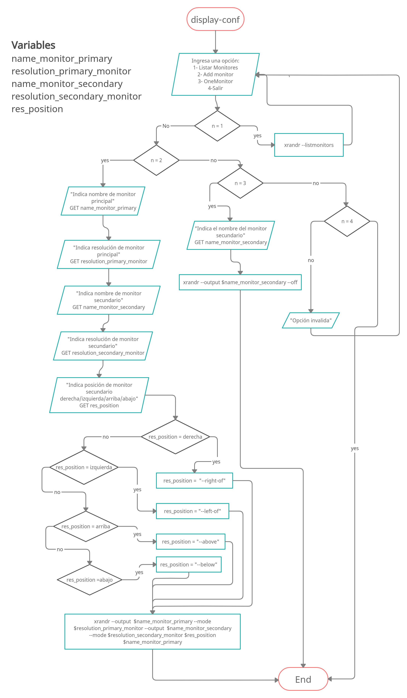
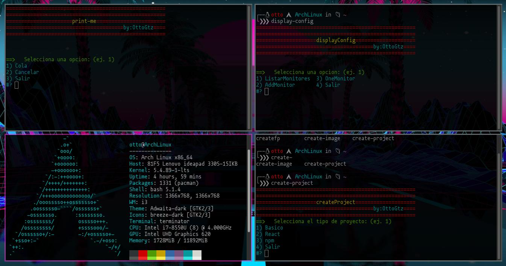

# Scripting Bash

Scripts creados para automatizar mi entorno de trabajo en Linux.

Para crear un alias para cada script y correrlo desde la terminal, abrimos con nuestro editor de texto _.bashrc_

> vim ~/.bashrc

Creamos nuestro alias

> alias create-project="bash ~/ruta/del/script/createProject.sh"

Guardamos, salimos y escribimos

> source .bashrc

Ahora ya podemos ejecutar nuestro alias desde la terminal ubicados en cualquier carpeta.

> **create-project**

**NOTA:**
No olvidemos darle permiso de ejecución al Script a ejecutar.

> chmod +x nombreScript.sh

## Script createProject

Crea 3 tipos de proyectos, _basico_, _react_ y _ECMAs6_ con sus respectivos ficheros.

### Basico

Crea una carpeta con el nombre que se le indique y abre **vsCode** en esa carpeta.

La estructura que toma es:

- **js/**
  - **app.js**
- **css/**
  - **style.css**
- **index.html**

#### Configuración del Script

Para configurar el script y se pueda utilizar en su _computadora_ se debe de modificar la función de **basico** después de leer el nombre del proyecto dice:

> mkdir ~/Programming/scriptingBash/

Modifica la ruta de tu carpeta que tengas para proyectos, supongamos que tenemos una carpeta llamada **projects** dentro de tu carpeta de usuario.

> ~/projects/

Entonces se tendría que poner esa ruta

> mkdir ~/projects/"$name_project"

AL igual se debe de modificar el **change directory** o **cd** que viene abajo.

> cd ~/Programming/scriptingBash/"$name_project"

pasar a

> cd ~/projects/"$name_project"

Para abrir en **vsCode** en la línea:

> code ~/Programming/scriptingBash/"$name_project"

Se modificaría a

> code ~/projects/"$name_project"

### React

Crea un proyecto de React con el nombre que se le indique y abre **vsCode** con el proyecto.

#### Configuración

Cambiar las rutas donde se creara

> cd ~/Programming/appsReact/

Si tenemos una carpeta llamada **projects** en nuestra carpeta de usuario y queremos que el proyecto se creé dentro de ella ponemos

> cd ~/projects/

Al igual se modifica la ruta para abrir en **vsCode**

> code ~/projects/"$name_project"

### npm

Crea e inicializa el proyecto en **npm** y abre el proyecto en vsCode

#### Configuración

Cambiar la ruta de **mkdir**, **cd** y **code**

> mkdir ~/Programming/"$name_project"

> cd ~/Programming/"$name_project"

> code ~/Programming/"name_project"

## Script print-me

Imprime desde consola una o más copías de un archivo.

Comprueba si es un archivo y que no este vacio, si lo es retornara un mensaje y **NO** lo imprimira.

Se le puede pasar 0, 1 o 2 parametros, si no recibe un parametro mostrara un **menú** con las opciones:

- Cola: Mostrara las impresiones en cola de la impresora.
- Cancelar: Cancelara la impresión actual en la impresora.
- Salir: Salir del Script.

Si recibe _parametros_

- El primer parametro será la ruta donde este el _documento_ e imprimira _una sola copia_
  > ./print-me.sh ~/Documents/documento.docx
- El segundo parametro sera el _número de copías a imprimir_. Si se le pasa **1** imprimira _una sola copia_ como si no se le hubiera pasado un segundo parametro. Su **limite** son **30 copias**
  > ./print-me.sh ~/Documents/documento.docx 3

_Si en alguno de los dos parametros se le pasa algo invalido no imprimira y mandara un mensaje de error, por ejemplo si como segundo parametro se le pasa_ **n <= 0** || **n >= 31** || **n != enteros** _mandara un mensaje de error y no imprimira._

### Crear alias

En **.bashrc** creamos el alias.

> nano .bashrc

Y escribimos

> alias print-me="bash ~/projects/scriptingBash/print-me.sh"

El nombre del alias puede cambiar, en lugar de _print-me_ podemos poner otro, al igual la ruta donde tengan el script guardado, por ejemplo:

> alias imprime="bash ~/.config/scripts/print-me.sh"

En el anterior ejemplo el alias se llama _imprime_ y el script esta en una carpeta llamada _scripts_ dentro de _.config_.

## Script display-config

**NOTA:** Se debe de tener instalado _xrandr_

**Xrandr** es una herramienta de _terminal_ que sirve para manipular los monitores. Con ayuda de esta herramienta se realizo este Script, que lo único que hace es pedir los datos e ingresarlos como valores en sus respectivos parametros para las configuraciones básicas de _xrandr_.

Las opciones que tiene **display-config** son:

- ListarMonitores: Listar los monitores.
- AddMonitor: Añade un monitor.
- OneMonitor: Desactivar el monitor secundario.
- Salir: Salir del script.

### Opción ListarMonitores

Al seleccionar esta opción mostrara lo siguiente:

> 0: +\*eDP1 1366/340x768/190+0+0 **eDP1**

> 1: +HDMI1 1366/340x768/190+1366+0 **HDMI1**

_NOTA:_ _puede que solo aparezca el primero, es normal, solo que el segundo monitor esta desactivado._

Lo que aparece en **negritas** es el nombre del monitor, en este caso mis monitores se llaman **eDP1** y **HDMI1**, lo más común es que si estas conectado por HDMI a tú monitor tenga el mismo nombre, si estan por _VGA_ podría aparecer como **VGA-0**, para más información puedes leer su manual.

> man xrandr

La resolución la tomaremos de la siguiente forma, donde _1366_ es el ancho y _768_ el alto, entonces nuestra resolución sería **1366x768**

### Opción AddMonitor

En esta opción nos ira pidiendo el _nombre_, _resolución_ de cada monitor y al final la _posición_ donde queremos colocar el segundo monitor. Es importante escribir el nombre del monitor tal cual aparece, _eDP1_ es **correcto**, _EDP1_ es **incorrecto**.

Al igual la resolución no debe de llevar espacios ni el signo * para sustituir la *x* forzosamente debe de ser *x* **1366x768** es **correcto**, \*\*1366*768** ó **1366 x 768** es **incorrecto.

Al asignar la posición son validas las siguientes entradas:

- Para derecha se puede escribir: _derecha_, _der_ ó _right_.
- Para izquierda se puede escribir: _izquierda_, _izq_ ó _left_.
- Para arriba se puede escribir: _arriba_, _arr_ ó _above_.
- Para abajo se puede escribir: _abajo_, _aba_ ó _below_.

Cuando termina este proceso mostrara un mensaje parecido:

> xrandr --output eDP1 --mode 1366x768 --output HDMI1 --mode 1366x768 --right-of eDP1

Esa fue la línea de comandos que se ejecuto para activar el segundo monitor. Podemos copiarla y crear un alias en **.bashrc**

> alias activarMonitor="xrandr --output eDP1 --mode 1366x768 --output HDMI1 --mode 1366x768 --right-of eDP1"

> source .bashrc

Ahora cada vez que no tengamos el monitor activado ya sea porque se acaba de iniciar sesión o alguna otra situación solo escribimos en la terminal

> activarMonitor

Y se realizara la configuración del monitor.

### Opción OneMonitor

Si tenemos activado el segundo monitor y queremos desactivarlo, solo nos pedira el nombre del segundo monitor y lo desactivara. Al terminar mostrara un mensaje parecido

> xrandr --output HDMI1 --off

Que al igual que al activarlo es la línea de comandos que se ejecuto, podemos hacer lo mismo, crear un alias para desactivar el monitor sin necesidad de escribir todos esos comandos.

### Crear alias

Aunque para este script no es muy necesario un alias ya que sería algo tedioso estar configurando todo cada vez que cerremos sesión o prendamos nuestro equipo, por eso mismo la recomendación de crear un alias con la línea de comando que aparece tanto al activar como al desactivar un monitor. Pero no esta demás tener un alías por cualquier cosa y no estar ingresado toda la ruta de nuestro script.

Abrimos **.bashrc**

> nano ~/.bashrc

y escribimos el siguiente alias, el nombre del alias y la ruta pueden cambiar a como sean requeridos o deseados.

> alias display-config="bash ~/projects/scriptingBash/display-config.sh"

Ahora cada vez que escribamos _display-config_ en nuestra terminal se ejecutara el script.

### Diagrama

## Screen de scripts

